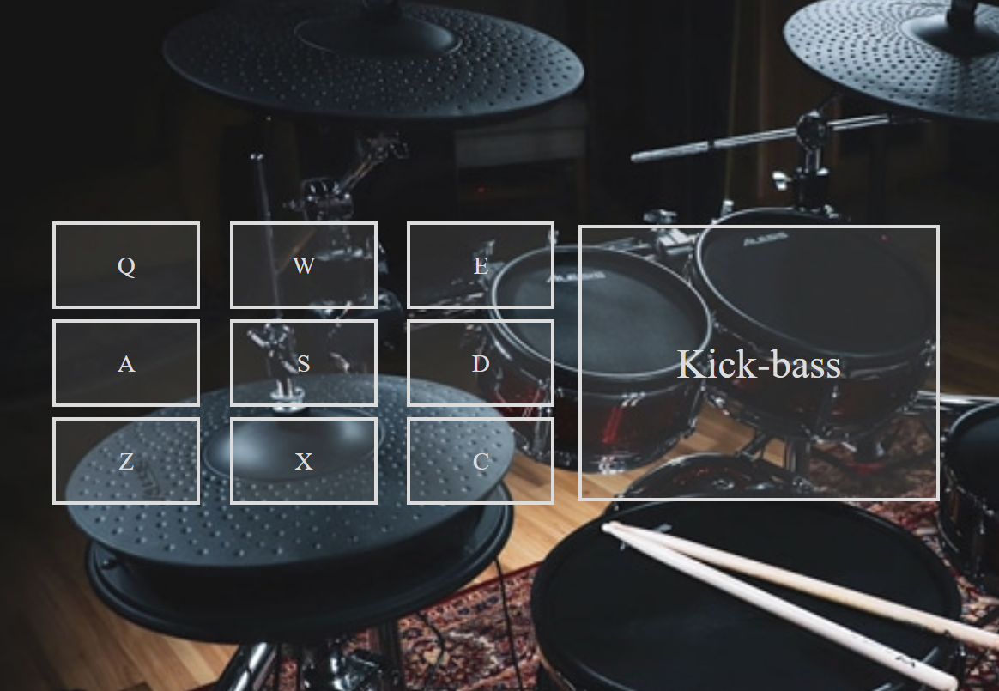

## JavaScript Drum-Machine

#### A Front-End Project from &ensp; &ensp; 

 

> See here [The User Stories](https://www.freecodecamp.org/learn/front-end-libraries/front-end-libraries-projects/build-a-drum-machine) to follow

 

<https://codepen.io/filip76/pen/MWjRrxR> 

